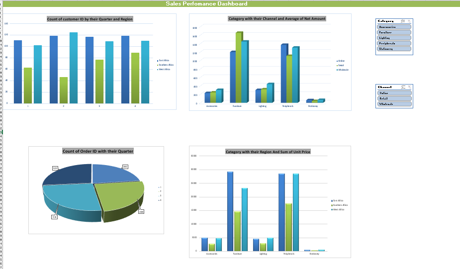

# 📊 Excel Sales Dashboard

An interactive **Sales Dashboard** built using **Microsoft Excel** to analyze sales performance across regions, categories, channels, and transaction types. This dashboard enables users to explore data dynamically using Pivot Tables, Pivot Charts, and Slicers for better business decision-making.

---

## 📸 Dashboard Preview

> Upload a screenshot of your dashboard and save it as **dashboard.png** in this repository.



---

## 📖 Project Overview

This project demonstrates how Microsoft Excel can be used to transform raw sales data into meaningful insights through interactive visualizations. The dashboard allows users to filter data and monitor key sales metrics, making it suitable for business reporting and data analysis.

---

## 🎯 Objectives

- Analyze customer distribution across different regions.
- Compare average sales performance by product category.
- Evaluate sales through different sales channels.
- Monitor monthly sales trends.
- Analyze order distribution by transaction category.
- Compare average unit prices across regions and quarters.

---

## 📊 Dashboard Features

- Interactive Pivot Tables
- Pivot Charts
- Slicers for dynamic filtering
- Clustered Column Charts
- Pie Chart
- Line Chart
- Automatic data summarization
- Professional dashboard layout

---

## 📈 Key Metrics

The dashboard includes analysis of:

- Customer Count by Region and Quarter
- Average Net Amount by Category and Sales Channel
- Order Distribution by Transaction Category
- Monthly Average Gross Amount
- Average Unit Price by Category, Quarter, and Region

---

## 🛠 Tools & Skills Used

- Microsoft Excel
- Pivot Tables
- Pivot Charts
- Slicers
- Excel Tables
- Data Cleaning
- Data Analysis
- Data Visualization
- Dashboard Design
- Business Reporting

---

## 📂 Project Structure

```
Excel-Sales-Dashboard/
│
├── Sales_Dashboard.xlsx
├── dashboard.png
└── README.md
```

---

## 📌 How to Use

1. Download the `Sales_Dashboard.xlsx` file.
2. Open it in Microsoft Excel (2016 or later recommended).
3. Navigate to the **Dashboard** worksheet.
4. Use the **Category** and **Channel** slicers to filter the dashboard.
5. Explore the charts to gain insights into sales performance.

---

## 💡 Business Insights

This dashboard helps answer questions such as:

- Which region has the highest number of customers?
- Which product category generates the highest average sales?
- Which sales channel performs best?
- How do sales vary throughout the year?
- Which transaction category contributes the most orders?
- How do unit prices compare across regions?

---

## 🚀 Learning Outcomes

Through this project, I strengthened my skills in:

- Creating interactive Excel dashboards
- Building Pivot Tables and Pivot Charts
- Using Slicers for dynamic filtering
- Cleaning and organizing data
- Designing professional business reports
- Presenting insights through data visualization

---

## 📚 Future Improvements

- Add KPI cards for Total Sales, Total Orders, and Average Sales.
- Include additional filters such as Region and Quarter.
- Automate data refresh using Power Query.
- Recreate the dashboard in Power BI for enhanced interactivity.

---

## 👩‍💻 Author

**Cyizere Cynthia**

Final-year Bachelor of Information Technology student with an interest in Data Analytics, Data Engineering, and Business Intelligence.

- GitHub: https://github.com/cynthiacyizere

---

## ⭐ If you found this project helpful

Feel free to ⭐ star this repository if you found it useful or inspiring.